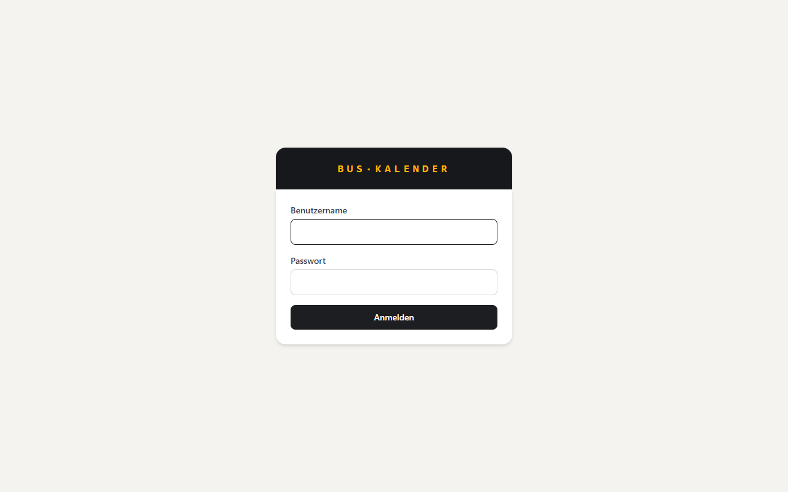
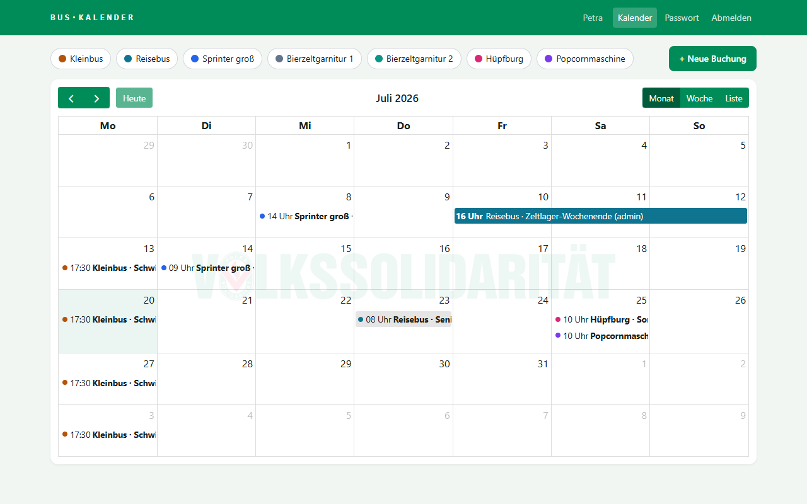
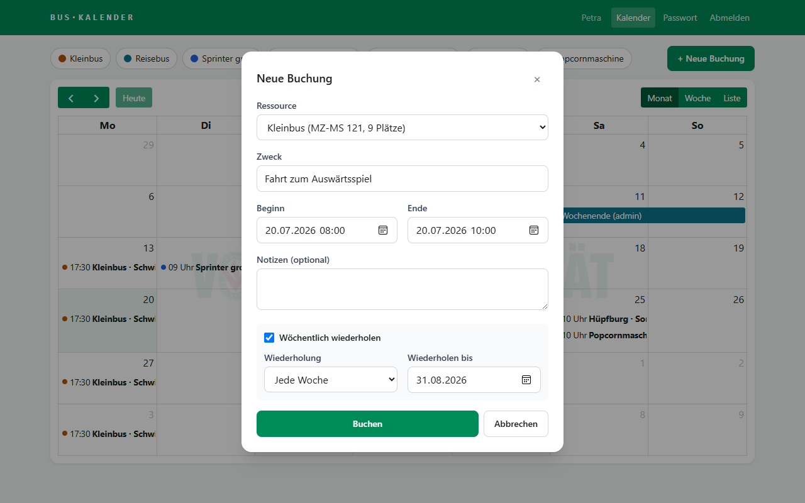
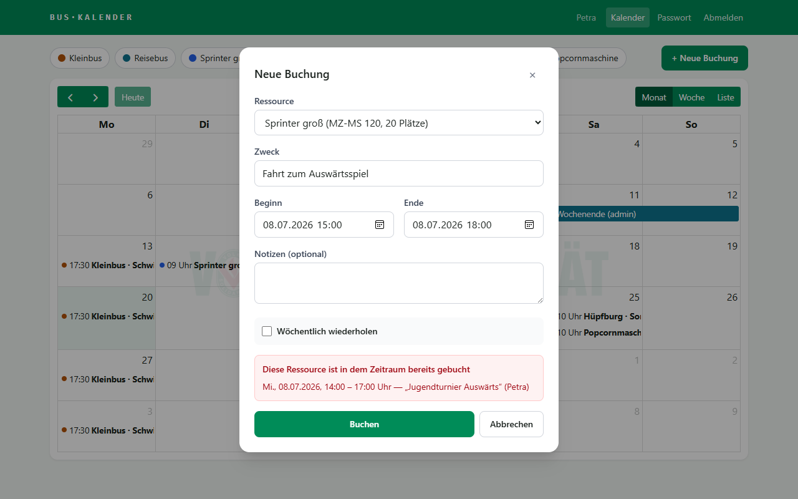
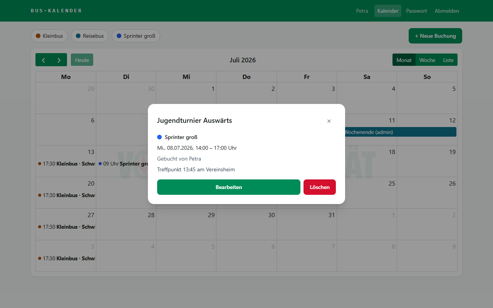
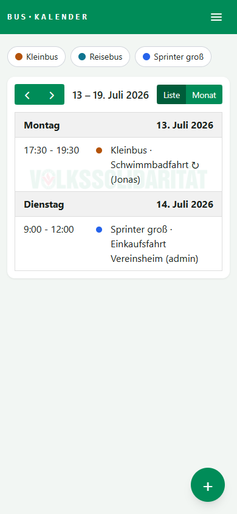
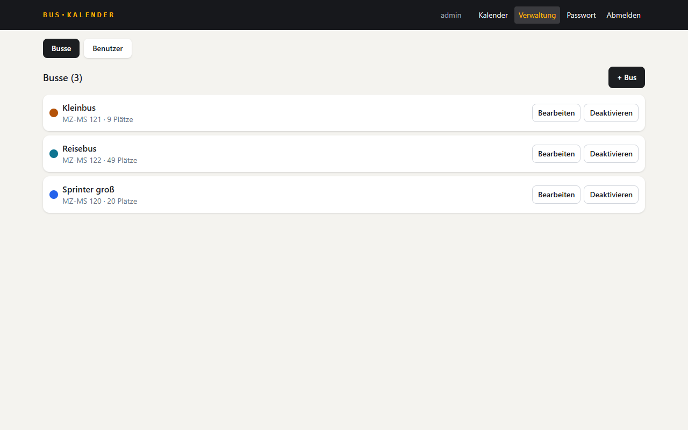

# Bus-Kalender – Benutzeranleitung

Der Bus-Kalender zeigt, wann welcher Vereinsbus frei ist, und ermöglicht es, eigene Fahrten einzutragen. Die App funktioniert am Computer und auf dem Smartphone im Browser — einfach die Adresse öffnen, die vom Administrator mitgeteilt wurde.

## 1. Anmelden

Melden Sie sich mit Ihrem Benutzernamen und Passwort an. Beides erhalten Sie vom Administrator.

## 2. Der Kalender

Nach der Anmeldung erscheint der gemeinsame Kalender mit allen Buchungen. **Jeder Bus hat seine eigene Farbe** — welche Farbe zu welchem Bus gehört, zeigen die Knöpfe über dem Kalender. Ein Klick auf einen Bus-Knopf blendet dessen Buchungen aus oder wieder ein; so lässt sich schneller ein freier Bus finden.

Oben rechts kann zwischen **Monat**, **Woche** und **Liste** gewechselt werden. Das ↻-Symbol an einem Termin bedeutet: Der Termin wiederholt sich wöchentlich.

## 3. Einen Bus buchen

Klicken Sie auf **„+ Neue Buchung“** (oder ziehen Sie im Kalender einfach über den gewünschten Zeitraum). Wählen Sie den Bus, geben Sie den Zweck der Fahrt an und legen Sie Beginn und Ende fest.

Für regelmäßige Fahrten (z.B. jeden Montag zum Training) haken Sie **„Wöchentlich wiederholen“** an und geben an, bis wann sich der Termin wiederholen soll.

## 4. Wenn der Bus schon belegt ist

Doppelbuchungen sind nicht möglich. Falls sich die Anfrage mit einer bestehenden Buchung überschneidet, zeigt die App an, **wer den Bus wann gebucht hat** — wählen Sie dann einfach eine andere Zeit oder einen anderen Bus.

## 5. Buchung ansehen, ändern oder löschen

Ein Klick auf einen Termin zeigt die Details. **Eigene Buchungen** können dort bearbeitet oder gelöscht werden — bei Serienterminen fragt die App, ob nur dieser eine Termin oder dieser und alle folgenden geändert bzw. gelöscht werden sollen. Fremde Buchungen lassen sich nur ansehen.

## 6. Auf dem Smartphone

Auf dem Smartphone zeigt die App automatisch eine übersichtliche Listenansicht. Mit dem **+**-Knopf unten rechts legen Sie eine neue Buchung an. Das Menü (Kalender, Verwaltung, Passwort ändern, Abmelden) erreichen Sie über den **☰**-Knopf oben rechts.

## 7. Passwort ändern

Über **„Passwort“** oben in der Leiste (am Smartphone im ☰-Menü) können Sie jederzeit Ihr eigenes Passwort ändern. Sollten Sie es vergessen haben, kann der Administrator es zurücksetzen.

## 8. Für Administratoren: Verwaltung

Administratoren sehen zusätzlich den Menüpunkt **„Verwaltung“**. Dort werden Busse angelegt (Name, Kennzeichen, Sitzplätze, Kalenderfarbe) und die Benutzer verwaltet: neue Mitglieder anlegen, Passwörter zurücksetzen, Konten deaktivieren oder Admin-Rechte vergeben. Administratoren dürfen außerdem alle Buchungen bearbeiten und löschen.

